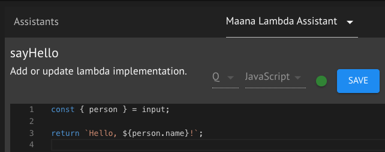

# TypeScript based Maana Q Knowledge Microservice Template

## Folder Layout

```
/ - the root directory.
| src/ - contains all of the source code.
  | model/ - The custom models used with the service.
  | resolvers/ - The resolvers that define how the schema is resolved.
  | schemas/ - The schema of the public facing GraphQL API.
| .env.template - A template .env file to use as a starting point.
| .codegen.yml - Configuration for the code generation from GraphQL.
| Dockerfile - Defines how the docker container is built.
| package.json - Node configuration and metadata file.
| tsconfig.json - Configuration for the TypeScript compiler.
```

## Customization

* Change the name and description of the module

  In `package.json`, edit the metadata:

  ```json
  {
    "name": "sample",
    "author": "Acme, Inc.",
    "license": "MIT",
    "version": "1.0.0",
    "description": "Awesome Bot",
    "main": "src/server.js",
    "repository": "https://github.com/acme-inc/awesome-bot.git",
  ```

* Edit the `.env` file to reflect proper `PORT`, `SERVICE_ID`, and other service-specific parameters.
* Define your public-facing schema in the `src/schemas` folder and add resolvers for them in `src/resolvers`.

## Building and running

```
docker build . -t template-service
docker run -p 8050:8050 template-service:latest
```

## Code-Gen

This project uses the GraphQL Code Generator (https://graphql-code-generator.com)
CLI to generate types from its public-facing GraphQL schema. Each time this
schema is updated, the file `./src/schemas/gen-types.ts` needs to be
re-generated. To do this,

1. Make sure you have the GraphQL Code Generator dependencies installed.
   `npm install`
1. Run the service locally.
   `npm run startdev`
1. While the service is running, from another command window run the code-gen CLI.
   `npm run generate`
1. Verify that there are no issues with the generated file. The service will automatically recompile when the new `gen-types.ts` file is written. If there
are any errors, you will have to manually correct the file.

## Deploying the Service

### Prerequisits

* Maana CLI instanned (`graphql-cli` and `graphql-cli-maana`).
* Docker installed and running on your machine.
* KubeCtl installed and configured.

### Log into the Azure Container Registery

```
docker login --username [USER_NAME] --password [PASSWORD] [ACR_NAME].azurecr.io
```

### Deploy the Service

```
gql mdeploy
```

Options:

* Select `Private Docker Registry`.
* Enter the name of your service. `template-service`
* Enter the path to the Dockerfile for the service, if running from within the directory then just use `.`.
* Enter the name of your docker registry, the same one you logged into. `[ACR_NAME].azurecr.io`
* Set the version to tag the container with, `v1.0.0` is a good starting point.
* Set the number fo pods to spin up, usually you want to start with `1`.
* Set the port number you setup for your service, the default for the template is `80`.
* it `Y` to confirm you setup and start building and deploying your service.

## How to convert a Lambda function into a Knowledge Service

Lambda Functions are currently an **experimental feature**, and are not supported in production environments.

If you need to convert a series of Lambda functions to a service in order to improve performance, here is how that is done.

1. Given a Kind and Lambda function like this:
   - 
1. And a Lambda code definition like this:
   - 

First you must **update the schema definition** in `src/schemas/person.ts` to include the new query `sayHello`.

Find the line of code that defines the `Query` type and add your function signature:

```graphql
type Query {
  # other methods...
  sayHello(person: Person!): String
}
```

Then run `npm run generate` to update the `src/schemas/gen-types.ts` file with your updated query definition (this will fix TypeScript warnings when you add your new resolver to run the code from your lambda function).

Next, go to `src/resolvers/person.ts` to add the resolver for the `sayHello` function.

```ts
export const PersonResolver: Resolvers = {
  // ...
  Query: {
    // ...
    sayHello: (root, { person } /* <-- these are the function inputs from the function graph in Q */) => {
      return `Hello, ${person.name}!`;
    }
  }
}
```

And that's it! You should now be able to execute the query `sayHello` against this service.
